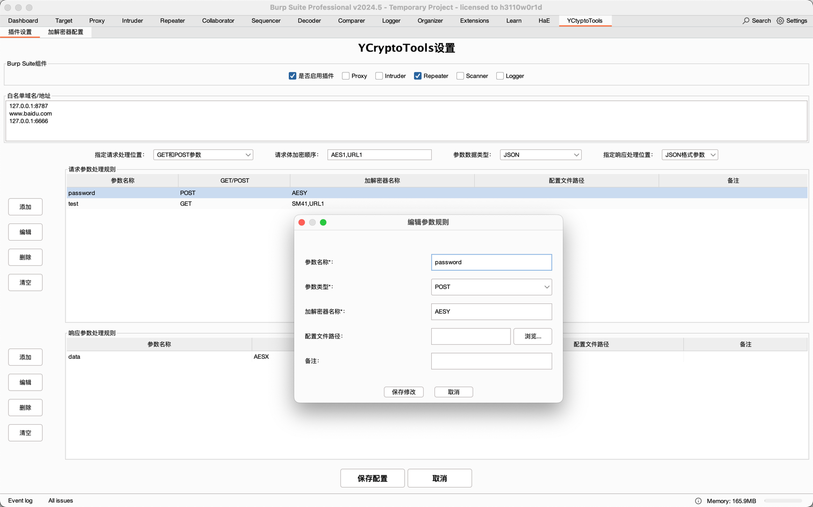
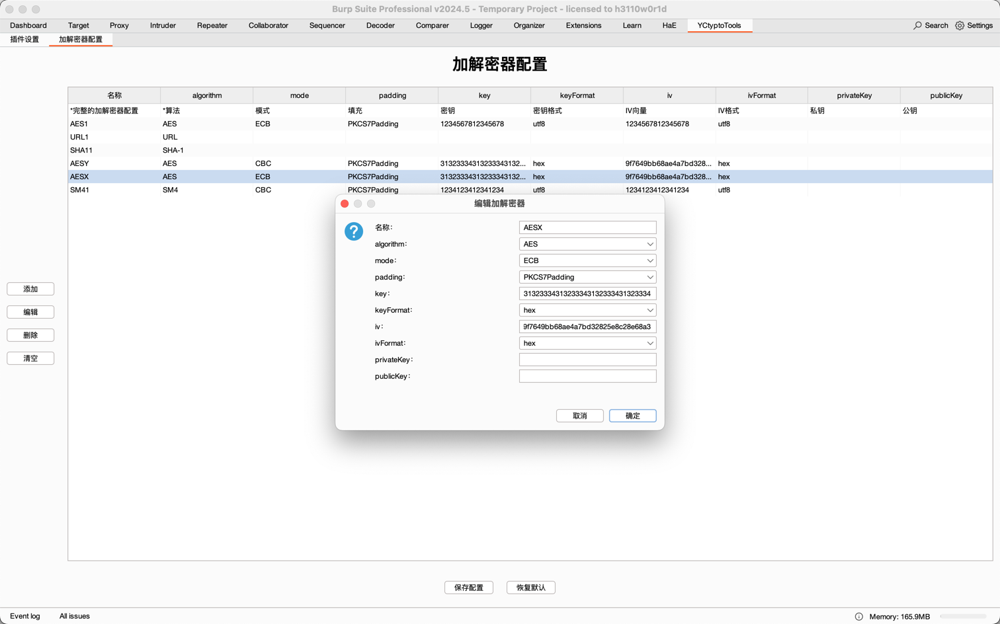
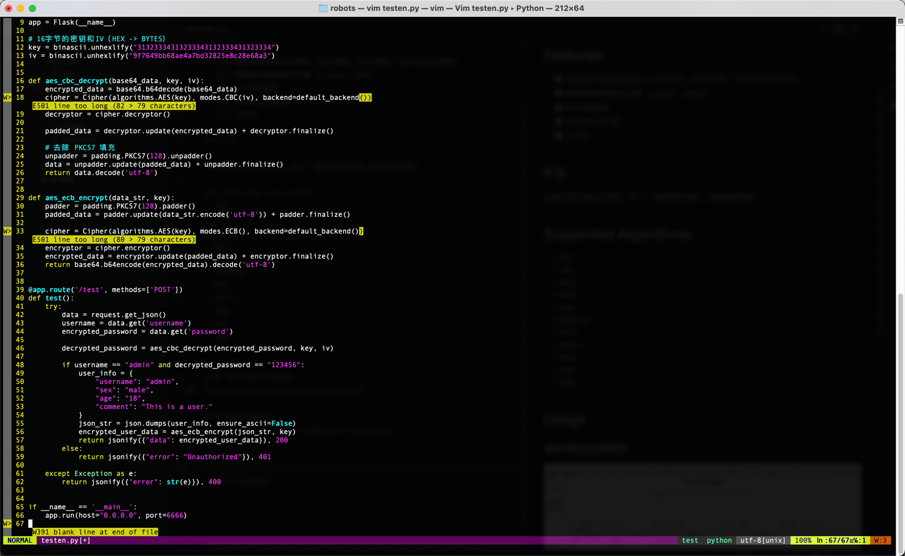
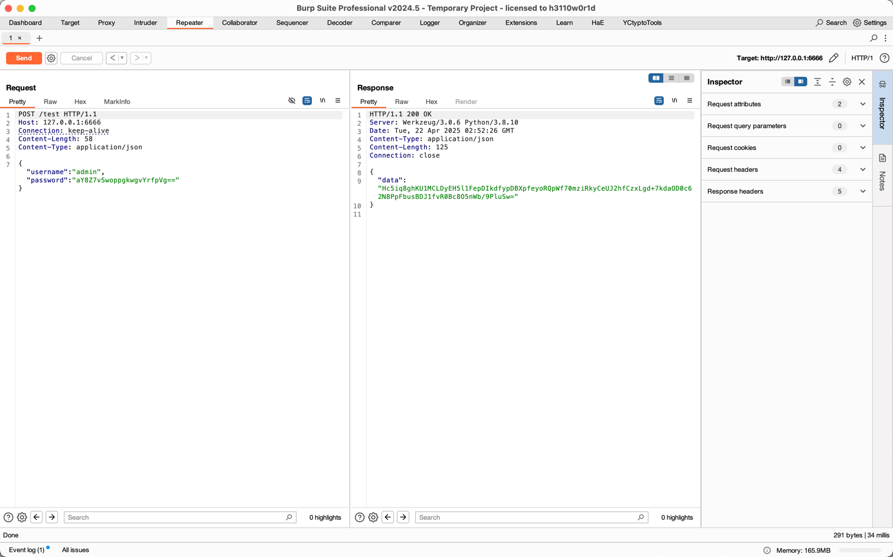
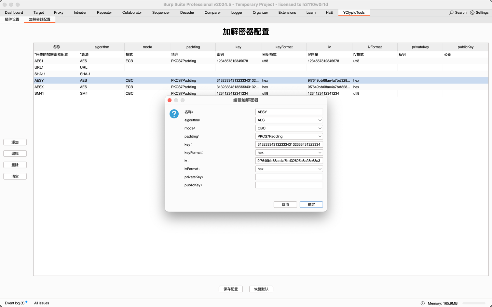
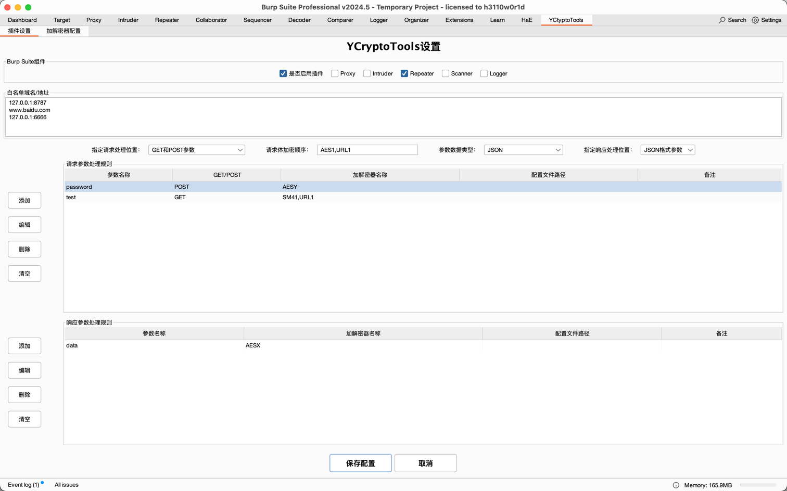
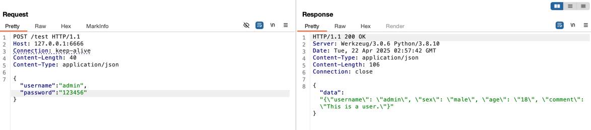

<h1 align="center">YCT - YCryptoTools</h1>
 

 

# YCryptoTools
一个前端加解密BurpSuite插件，用于加密解密请求和响应数据，方便渗透测试过程中分析HTTP流量。

## Features

- [x] 预置请求参数匹配规则（GET参数、POST参数、GET和POST参数）
- [x] 预置请求参数格式匹配（x-www、JSON）
- [ ] 复杂请求使用API加密解密
- [ ] 正则表达式匹配
- [ ] 占位符

## P.S.

目前只是方便自己使用，写了一些简单的功能，后续持续更新。

## Supported Algorithms
- URL
- AES
- DES
- RSA
- BASE64
- MD5
- SHA-1
- SM2
- SM3
- SM4

## Usage

### 请求/响应处理规则

### 加解密器配置

## Example

### AES-CBC

原始请求：

新增一个加解密器：

新增请求和响应处理规则：

使用加密器通过“,”按顺序分隔

发送请求进行自动加解密：

## Contributors

## LICENSE

[MIT](LICENSE) © Y5neKO